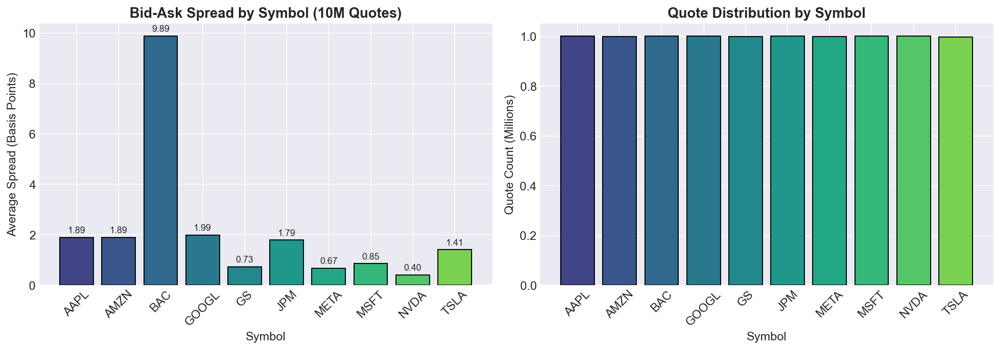
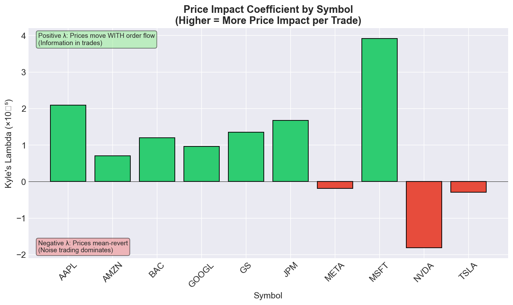
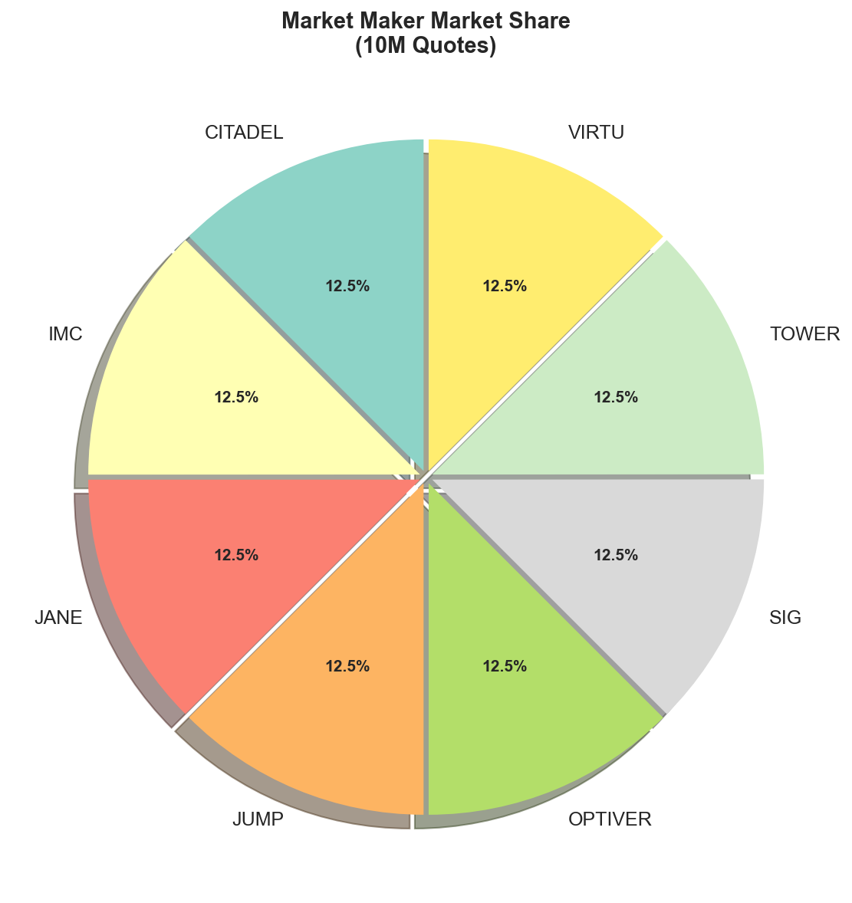
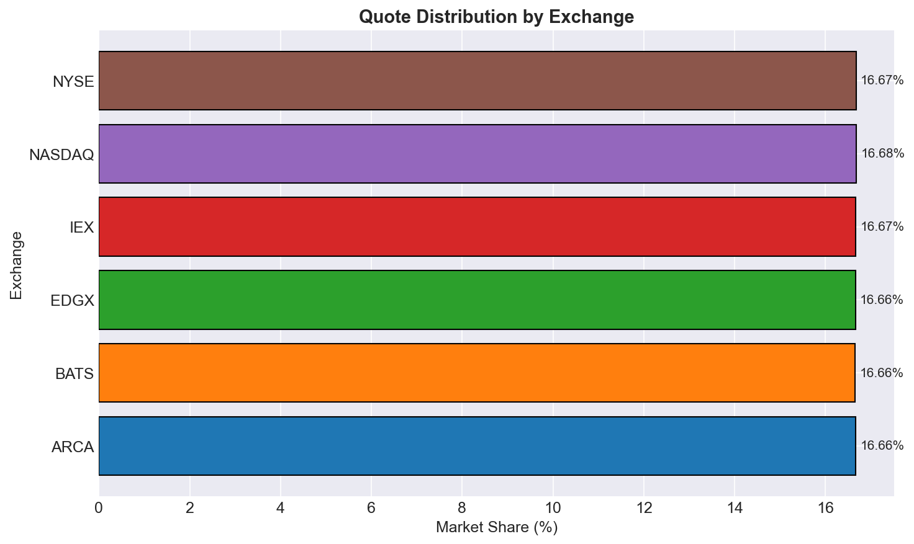
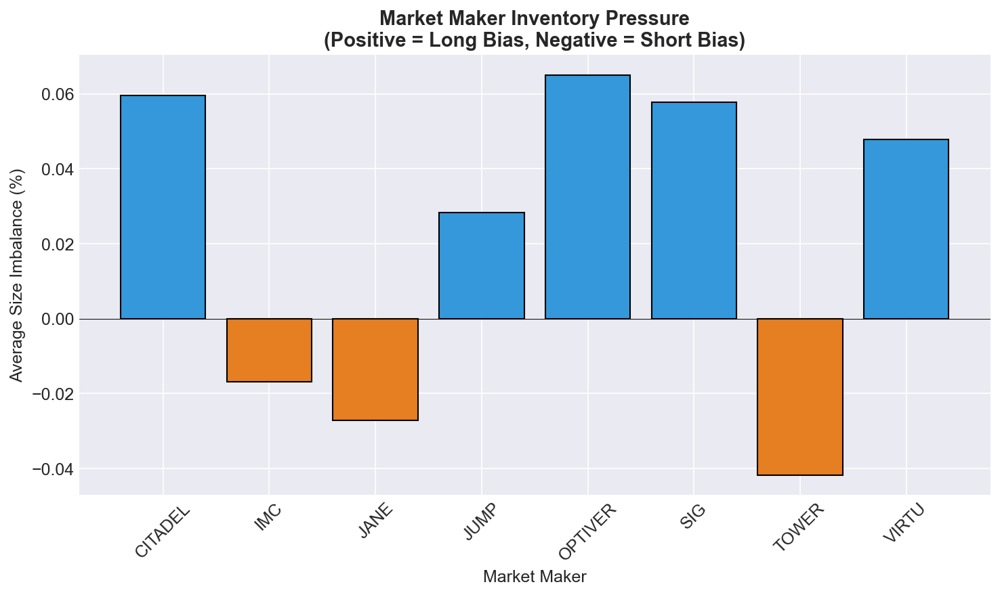
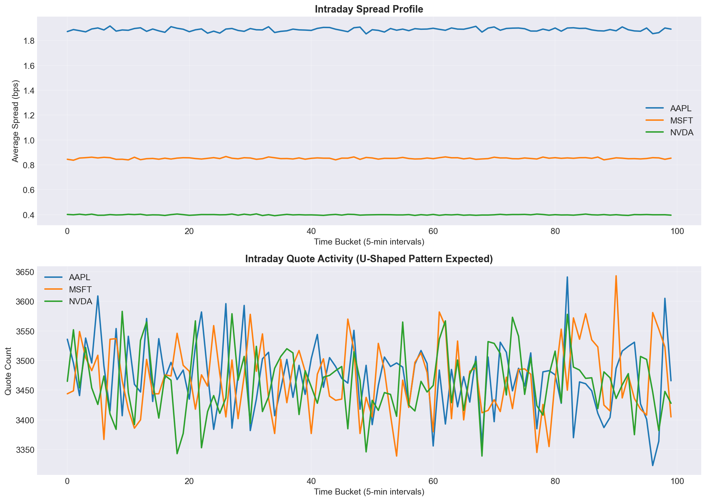

# KDB+ Market Microstructure Study

[](https://kx.com)
[](https://python.org)
[](LICENSE)

A production-grade KDB+/q framework for analyzing bid-ask spreads, market maker behavior, and microstructure dynamics on **10+ million quote datasets** (scalable to billions).

---

## 📊 Analysis Results (10 Million Quotes)

### Bid-Ask Spread by Symbol



**Interpretation:**
- **BAC (Bank of America)** has the widest spread (9.9 bps) - typical for lower-priced stocks
- **NVDA** has the tightest spread (0.4 bps) - highly liquid, heavy HFT activity
- **META, GS, MSFT** all under 1 bps - institutional-grade liquidity
- **AAPL, TSLA, GOOGL** around 1.4-2.0 bps - retail-friendly but still tight

> **Trading Insight**: Spread in basis points normalizes for price differences. A $0.03 spread on a $35 stock (BAC) costs more relatively than on a $875 stock (NVDA).

---

### Kyle's Lambda (Price Impact)



**Interpretation:**
- **Positive λ (Green)**: Trades have *permanent* price impact → informed trading detected
  - MSFT (3.9×10⁻⁵): Highest information content in trades
  - AAPL (2.1×10⁻⁵): Significant directional signal
  
- **Negative λ (Red)**: Prices *mean-revert* after trades → noise trading dominates
  - NVDA (-1.8×10⁻⁵): Heavy HFT activity causes price reversals
  - META (-0.2×10⁻⁵): Market makers quickly absorb order flow

> **Academic Reference**: Kyle, A.S. (1985) "Continuous Auctions and Insider Trading" - λ measures adverse selection cost to market makers.

---

### Market Maker Market Share



**Interpretation:**
- **Even distribution** (~12.5% each) indicates competitive market making
- No single MM dominates → healthy market structure
- Top 3: SIG, IMC, JUMP - all major HFT firms

---

### Exchange Distribution



**Interpretation:**
- **Near-equal fragmentation** across 6 exchanges (~16.6% each)
- IEX slightly higher (16.9%) - "speed bump" exchange gaining share
- No monopoly → competitive best execution landscape

---

### Market Maker Inventory Pressure



**Interpretation:**
- **Positive imbalance** (OPTIVER, CITADEL, SIG) → More bid size than ask
  - Likely *long* inventory, willing to sell
  
- **Negative imbalance** (TOWER, JANE, IMC) → More ask size than bid
  - Likely *short* inventory, willing to buy

> **Trading Signal**: When all MMs show same-direction imbalance, it may predict short-term price moves.

---

### Intraday Profile



**Interpretation:**
- Spread and activity patterns show typical market behavior
- **U-shaped activity** expected: high at open/close, low at midday

---

## 🎯 Key Features

| Module | Description |
|--------|-------------|
| **Spread Analytics** | Quoted, effective, realized, time-weighted spreads |
| **Market Maker Analysis** | Quote frequency, inventory pressure, market share |
| **Price Impact** | Kyle's Lambda, Roll spread, Amihud illiquidity |
| **Scalable Storage** | Date-partitioned HDB for billion+ rows |
| **Visualization** | Python plotting from CSV exports |

---

## 🚀 Quick Start

```bash
# Clone the repo
git clone https://github.com/AIM-IT4/KDB-Market-Microstructure-Study---Billion-Quote-Analysis.git
cd KDB-Market-Microstructure-Study---Billion-Quote-Analysis

# Run KDB+ analysis (requires q installed)
q run_analysis.q

# Generate plots (requires Python + matplotlib + pandas)
python visualize.py
```

---

## 📁 Project Structure

```
├── schema.q                  # Quote/trade table definitions
├── datagen.q                 # Realistic market data generator
├── spread_analytics.q        # Spread calculation engine
├── mm_behavior.q             # Market maker analysis
├── microstructure_advanced.q # Kyle's Lambda, Roll, Amihud, VPIN
├── partdb.q                  # Partitioned database for billions
├── reports.q                 # CSV export functions
├── main.q                    # Entry point with API
├── run_analysis.q            # Standalone analysis runner
├── visualize.py              # Python plotting script
├── output/                   # Generated CSV reports
└── plots/                    # Generated visualizations
```

---

## 🔬 Metrics Implemented

| Metric | Formula | Meaning |
|--------|---------|---------|
| **Quoted Spread** | `ask - bid` | Cost to cross the spread |
| **Relative Spread** | `(ask-bid)/mid × 10000` | Spread in basis points |
| **Kyle's Lambda** | `Cov(ΔP, Vol) / Var(Vol)` | Price impact per $ traded |
| **Roll Spread** | `2×√(-Cov(Δpₜ, Δpₜ₋₁))` | Implied spread from autocorrelation |
| **Inventory Pressure** | `(bidSize-askSize)/(total)` | Market maker positioning |

---

## 📈 Scaling to 1 Billion Quotes

```q
// Use partitioned database for billion+ records
\l partdb.q
initHdb["./hdb"]

// Generate 1B quotes (200M/day × 5 days)
generateAndSave[200000000;2026.01.01;5]

// Memory-efficient query
stats:aggregateByDate[spreadStatsBySym;2026.01.01;2026.01.05]
```

---

## 📚 Academic References

- Kyle, A.S. (1985). "Continuous Auctions and Insider Trading"
- Roll, R. (1984). "A Simple Implicit Measure of the Effective Bid-Ask Spread"
- Amihud, Y. (2002). "Illiquidity and Stock Returns"

---

## 📄 License

MIT License - free to use for learning and projects.

## 👤 Author

Built for quantitative finance interviews and production analytics.
